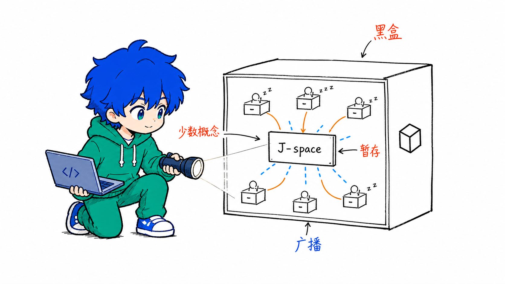

# BemoIllustration

> 把中文文章里的判断、流程、状态和隐喻，变成一张张带 Bemo 的白底手绘正文配图。
>
> 16:9 横版 | Bemo IP | 纯白手绘 | 品牌蓝/橙色/品牌绿中文批注 | Codex Skill

---

## 这个仓库是什么

BemoIllustration 是一个 Codex Skill，用来指导 AI Agent 为中文文章、帖子、博客、Notion 文档、工作流文档和方法论内容生成正文配图。

它不是通用插画 prompt，也不是 PPT 信息图模板。它的核心目标是：先理解文章里的认知锚点，再把其中一个判断、流程、结构、状态或隐喻，变成一张有记忆点的 16:9 手绘解释图。

默认视觉 IP 是 **Bemo**：蓝发、绿色 hoodie、开发者气质、常带电脑或代码符号的二次元像素/chibi 角色。Bemo 必须参与画面的核心动作，不能只是站在旁边当装饰。

一句话：**让 AI 不只是“配一张图”，而是把文章里的一个关键认知动作画出来。**

---

## 示例效果

### Anthropic J-Space



这张图示例了 Bemo 如何参与一个技术概念解释：他拿着镜头观察 J-Space，而不是站在旁边当吉祥物。

旧示例图仍保留在 `examples/images/` 和 `ian-xiaohei-illustrations/assets/examples/`，只作为线条密度、留白和怪诞隐喻的参考。生成新图时不要复刻旧构图。

---

## 适合谁用

特别适合：

- 写中文文章，需要正文配图和文章插图的人
- 做知识型内容、方法论内容、AI 工作流内容的人
- 想把抽象判断画成具体隐喻的人
- 想稳定复用 Bemo 这套个人品牌视觉语言的人
- 用 Codex 做内容生产，希望生成风格一致的配图资产的人

不适合：

- 想要商业插画、品牌 KV 或精致扁平插画的人
- 想要传统 PPT 信息图、复杂架构图或流程图的人
- 想要儿童卡通、表情包或纯贴纸风格的人
- 想把大量正文、长段解释或完整课程页塞进一张图里的人
- 需要严格可编辑矢量源文件的人

---

## 视觉风格

这个 skill 默认使用 Bemo 怪诞正文配图风格：

- 纯白背景，不要纸纹、米色、阴影、渐变
- 黑色手绘线稿，细线，轻微抖动
- 大量留白，主体只占画面约 40%-60%
- 少量中文手写批注，最多 5-8 处
- 品牌蓝 `#012fe3`：重点、问题、提醒、结果
- 橙色：主流程、路径、箭头、自动化流向
- 品牌绿 `#01c193`：补充说明、反馈、系统状态
- 一张图只表达一个核心动作、结构、状态或隐喻
- Bemo 必须参与核心动作，不能只是装饰
- 怪诞、有创意、清爽，但不幼稚、不卖萌

---

## 安装

克隆仓库：

```bash
git clone https://github.com/Mengbooo/BemoIllustration.git
cd BemoIllustration
```

复制 skill 到 Codex skills 目录：

```bash
mkdir -p "${CODEX_HOME:-$HOME/.codex}/skills"
cp -R ./ian-xiaohei-illustrations "${CODEX_HOME:-$HOME/.codex}/skills/"
```

当前 skill 调用名仍是：

```text
$ian-xiaohei-illustrations
```

安装后，在 Codex 里使用：

```text
Use $ian-xiaohei-illustrations 为这篇中文文章设计并生成 5 张 Bemo 正文配图。
```

---

## 怎么用

### 只做配图规划

```text
Use $ian-xiaohei-illustrations 先不要生图。
请分析下面这篇文章哪里值得配图，输出 5 张左右的 shot list。
每张图写清楚：放在哪段后、主题、核心意思、结构类型、Bemo 在做什么、建议中文标注词。

<粘贴文章>
```

### 直接生成正文配图

```text
Use $ian-xiaohei-illustrations 把下面这篇文章生成 4 张 Bemo 正文配图。
要求：16:9 横版、纯白背景、黑色手绘线稿、少量品牌蓝/橙色/品牌绿中文手写批注。

<粘贴文章>
```

### 为单个概念生成一张图

```text
Use $ian-xiaohei-illustrations 为“Anthropic 的 J-Space 是一个内部工作台，不是最终输出”生成一张正文配图。
画面要怪诞但清爽，Bemo 必须承担核心动作。
```

### 去掉图里的标题或错误文字

```text
Use $ian-xiaohei-illustrations 帮我编辑这张图，去掉左上角的“流程图”标题，其他内容保持不变。
```

---

## 工作流程

这个 skill 的流程是：

1. 读取文章、Markdown、Notion 内容、截图或用户给的主题
2. 提炼核心观点、认知转折、流程结构和适合视觉化的段落
3. 先输出 shot list：每张图只选一个认知锚点
4. 为每张图选择结构类型：Workflow、系统局部、前后对比、角色状态、概念隐喻、方法分层、地图路线或小漫画分镜
5. 重新发明一个低科技、怪诞但成立的物理隐喻
6. 让 Bemo 承担核心动作
7. 每张图单独调用图像模型生成
8. 按 QA checklist 检查：白底、留白、Bemo 动作、中文标注、非 PPT 感、非旧案例复刻
9. 保存最终 PNG，并报告用途和路径

---

## 目录结构

```text
.
├── README.md
├── LICENSE
├── NOTICE.md
├── examples/
│   ├── images/
│   │   ├── bemo-j-space-example.png
│   │   └── ...
│   └── prompts.md
└── ian-xiaohei-illustrations/
    ├── SKILL.md
    ├── agents/
    │   └── openai.yaml
    ├── assets/
    │   ├── brand/
    │   └── examples/
    └── references/
        ├── brand-character.md
        ├── composition-patterns.md
        ├── prompt-template.md
        ├── qa-checklist.md
        └── style-dna.md
```

真正需要安装到 Codex 的是子目录：

```text
ian-xiaohei-illustrations/
```

根目录的 README、LICENSE、NOTICE 和 examples 是 GitHub 分享文档。

---

## 注意事项

- 图片里的中文文字越短越稳定。
- 每张图只讲一个核心结构，不要把文章做成说明书。
- Bemo 必须承担核心动作；如果去掉 Bemo 画面仍然完全成立，说明 Bemo 太装饰了。
- 示例图只用于校准线条密度、留白、颜色克制和 Bemo 参与方式，不要复刻构图。
- AI 图像模型可能出现错字、幻觉标签、风格漂移或多余标题，生成后需要检查。
- 如果中文错字严重，优先减少标注词并重生成。

---

## Attribution

BemoIllustration 是基于 Ian Xiaohei Illustrations fork 后改造的个人品牌配图 skill。原始仓库见 `upstream`：`helloianneo/ian-xiaohei-illustrations`。
